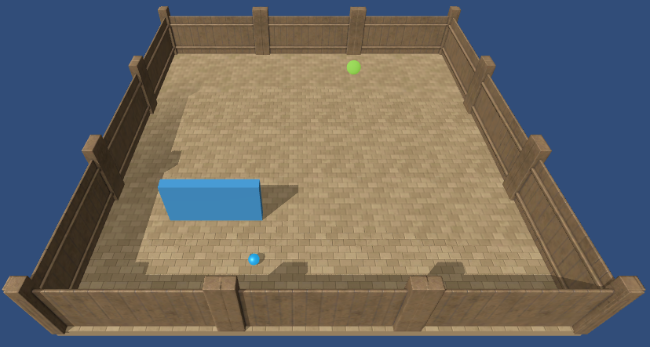
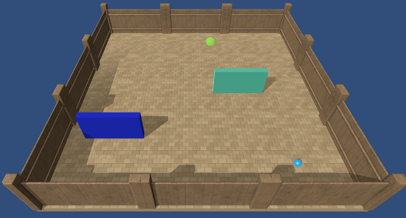
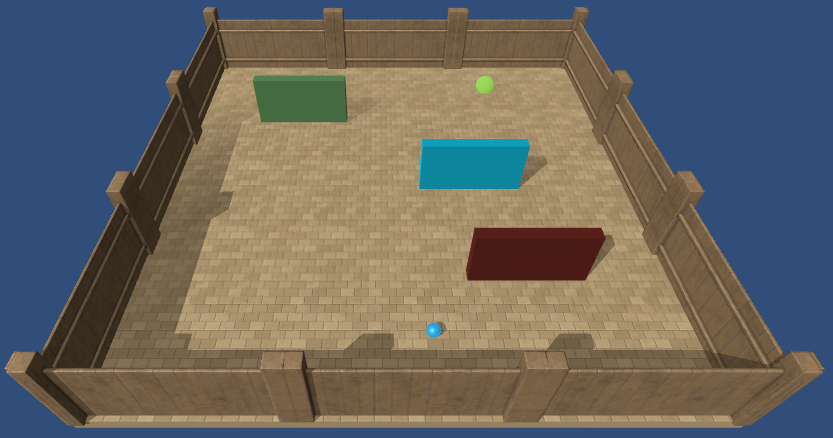
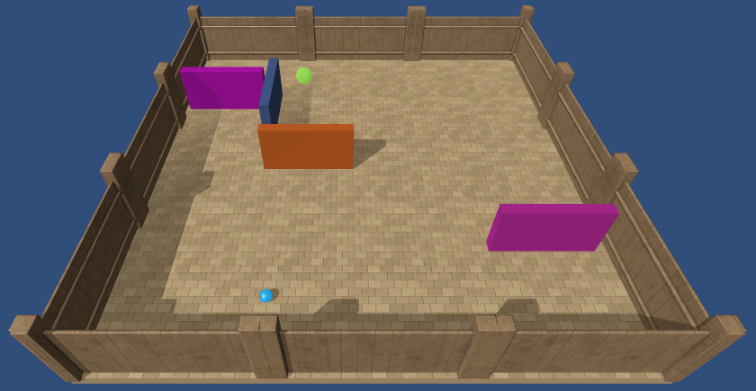
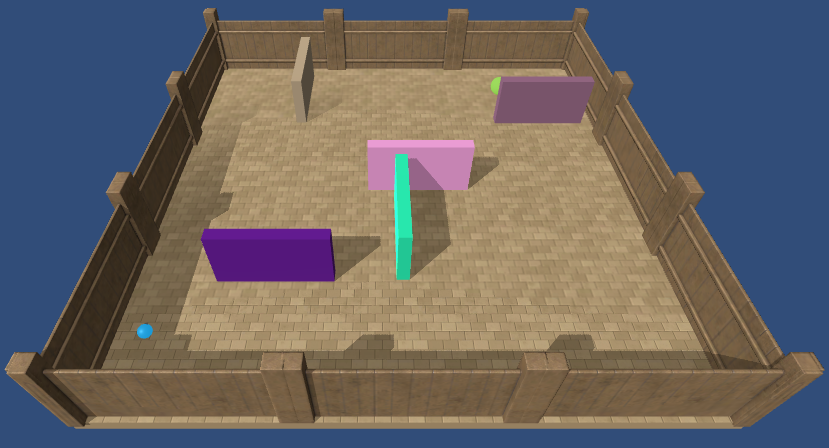
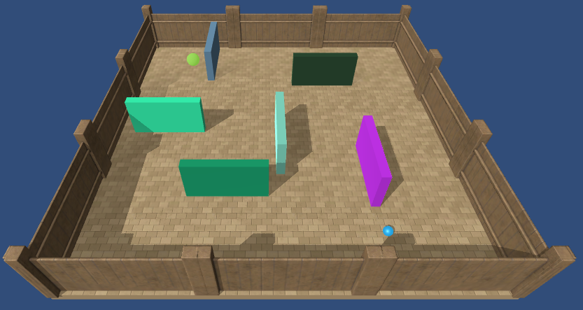
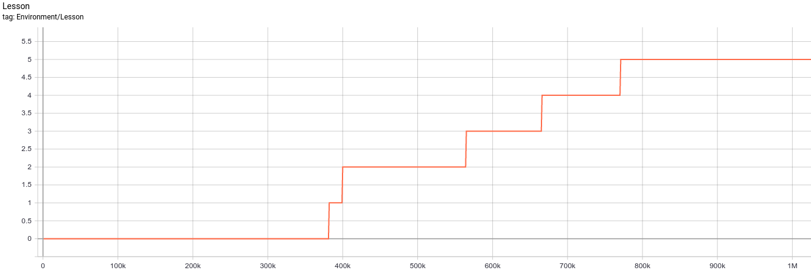

# Curriculum Learning

The `animalai-train` package contains a curriculum learning feature where you can specify a set of configuration files 
which constitute lessons as part of the curriculum. See the 
[ml-agents documentation](https://github.com/Unity-Technologies/ml-agents/blob/master/docs/Training-Curriculum-Learning.md) 
on curriculum learning for an overview of the technique. Our implementation is adapted from the ml-agents one, to use 
configuration files rather than environment parameters (which don't exist in `animalai`).

## Meta Curriculum

To define a curriculum you will need to provide the following:

- lessons (or levels), generally of increasing difficulty, that your agent will learn on, switching from easy to more difficult 
- a metric you want to monitor to switch from one level to the next
- the value for each of these thresholds

In practice, you will place these parameters in a `json` file named after the brain in the environment (`Learner.json` in 
our case), and place this file in a folder with all the configuration files you wish to use. This constitutes what we call 
a meta-curriculum.

## Example

An example is provided in [the example folder](../examples/configurations/curriculum). The idea of this curriculum is to train 
an agent to navigate a maze by creating maze like structures of perpendicular walls, starting with a single wall and food, 
adding one more wall at each level. Below are samples from the 6 different levels.


 |||
:--------------------:|:-------------------:|:-------------------:
 |||

To produce such a curriculum, we define the meta-curriculum in the following `json` format:

```
{
  "measure": "reward",
  "thresholds": [
    1.5,
    1.4,
    1.3,
    1.2,
    1.1
  ],
  "min_lesson_length": 100,
  "signal_smoothing": true,
  "configuration_files": [
    "0.yaml",
    "1.yaml",
    "2.yaml",
    "3.yaml",
    "4.yaml",
    "5.yaml"
  ]
}
```

All parameters are the same as in [ml-agents](https://github.com/Unity-Technologies/ml-agents/blob/master/docs/Training-Curriculum-Learning.md), 
except for the `configuration_files`. From the ml-agents documentation:

* `measure` - What to measure learning progress, and advancement in lessons by.
  * `reward` - Uses a measure received reward.
  * `progress` - Uses ratio of steps/max_steps.
* `thresholds` (float array) - Points in value of `measure` where lesson should
  be increased.
* `min_lesson_length` (int) - The minimum number of episodes that should be
  completed before the lesson can change. If `measure` is set to `reward`, the
  average cumulative reward of the last `min_lesson_length` episodes will be
  used to determine if the lesson should change. Must be nonnegative.

  __Important__: the average reward that is compared to the thresholds is
  different than the mean reward that is logged to the console. For example,
  if `min_lesson_length` is `100`, the lesson will increment after the average
  cumulative reward of the last `100` episodes exceeds the current threshold.
  The mean reward logged to the console is dictated by the `summary_freq`
  parameter in the
  [trainer configuration file](../examples/configurations/training_configurations/trainer_ml_agents_config.yaml).
* `signal_smoothing` (true/false) - Whether to weight the current progress
  measure by previous values.
  * If `true`, weighting will be 0.75 (new) 0.25 (old).
  
 The `configuration_files` parameter is simply a list of files names which contain the lessons in the order they should be loaded.
 Note that if you have `n` lessons, you need to define `n-1` thresholds. 
 

 ## Training
 
 Once the folder created, training is done in the same way as before but now we pass a `MetaCurriculum` object to the 
 `meta_curriculum` argument of a `TrainerController`.
 
 We provide an example using the above curriculum in [examples/train_curriculum.py](../examples/train_curriculum.py).
 Training this agent, you can see the lessons switch using tensorboard:
 
 
 
